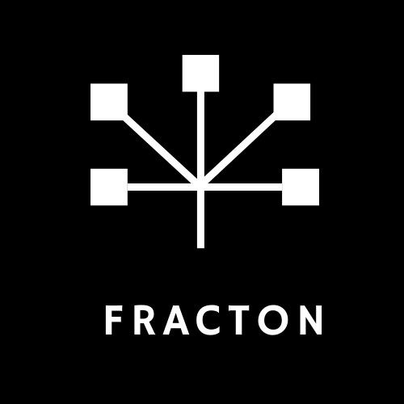

  

  <b>A high-performance, sharded, Redis-inspired key-value store written in Rust.</b>

  
  
  

## ✨ Features

- 🚀 High-performance sharding for concurrency and scalability

- ⚡ Async-first architecture powered by Tokio

- 🔒 Thread-safe job queues per shard

- 🧩 Extensible design for future features like transactions, clustering, and persistence

- 🦀 Built entirely in Rust, with safety and speed in mind

## 🤝 Contributing

Contributions, issues, and feature requests are welcome!
Feel free to open an issue
or submit a pull request.

## 📜 License

This project is licensed under the Apache 2.0 License – see the LICENSE
file for details.